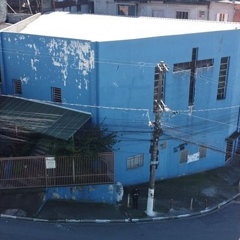
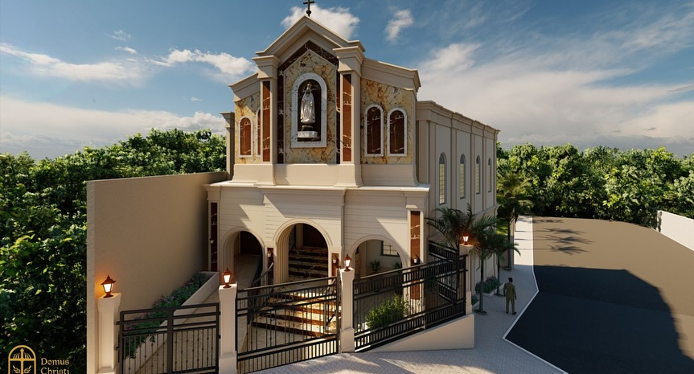
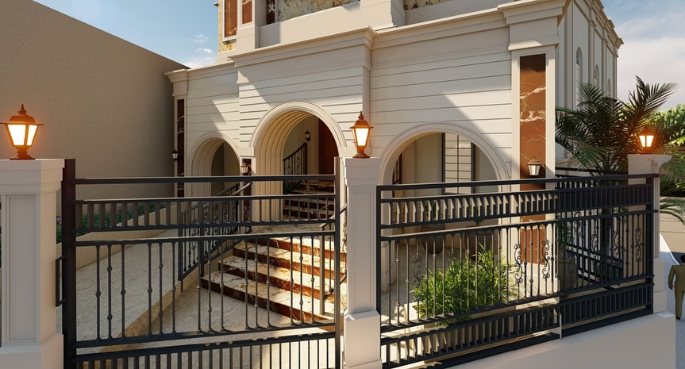
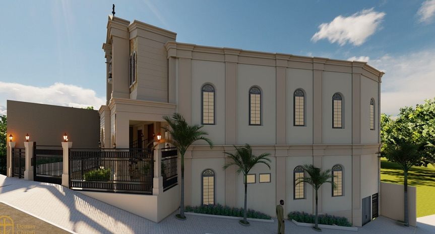

<!--doctype html-->
<html lang="pt-BR">
<head>
  <meta charset="utf-8" />
  <meta name="viewport" content="width=device-width, initial-scale=1" />
  <title>Campanha Casa da Mãe – Comunidade Nossa Senhora de Fátima</title>
  <meta name="description" content="Campanha Casa da Mãe – Reforma da parte exterior da Comunidade Nossa Senhora de Fátima. Participe com seu carnê ou PIX." />
  
  <link rel="preconnect" href="https://fonts.googleapis.com">
  <link rel="preconnect" href="https://fonts.gstatic.com" crossorigin>
  <link href="https://fonts.googleapis.com/css2?family=Inter:wght@400;600;800&display=swap" rel="stylesheet">
  
</head>
<body class="bg-gray-50 text-gray-900">
  <!-- Top Bar -->
  <header class="bg-gray-900 text-white text-sm">
    

      

        
        
Campanha Casa da Mãe • Comunidade Nossa Senhora de Fátima

      

      <a href="#contribua" class="inline-flex items-center gap-2 px-3 py-1.5 rounded-lg bg-amber-500 hover:bg-amber-600 transition">Quero contribuir</a>
    

  </header>

  <!-- Hero -->
  <section class="relative overflow-hidden">
    

    

      

        <h1 class="text-3xl md:text-5xl font-extrabold leading-tight">
          Campanha Casa da Mãe
        </h1>
        

          Reforma da parte exterior da Comunidade Nossa Senhora de Fátima. 
          Estamos melhorando a aparência exterior da nossa comunidade, renovando o espaço de fé para acolher melhor a todos. Conheça o projeto, veja a prestação de contas e participe com sua contribuição para essa obra na Casa da Mãe de Fátima.
        

        

          <a href="#projeto" class="px-5 py-3 rounded-xl bg-gray-900 text-white hover:bg-black transition">Ver o projeto</a>
          <a href="#contribua" class="px-5 py-3 rounded-xl ring-1 ring-amber-500 text-amber-700 hover:bg-amber-50 transition">Como contribuir</a>
        

        

          Endereço: Rua Narumi Nakayama, nº 701, Jardim Nossa Senhora de Fátima, Embu das Artes, SP
          

            <a href="https://www.google.com/maps/@-23.6451801,-46.8188284,3a,75y,17.7h,92.35t/data=!3m7!1e1!3m5!1s-mO2knxajZljQtwNW8TNVA!2e0!6shttps:%2F%2Fstreetviewpixels-pa.googleapis.com%2Fv1%2Fthumbnail%3Fcb_client%3Dmaps_sv.tactile%26w%3D900%26h%3D600%26pitch%3D-2.354190841221566%26panoid%3D-mO2knxajZljQtwNW8TNVA%26yaw%3D17.70397807261433!7i16384!8i8192?entry=ttu&g_ep=EgoyMDI1MDkxNy4wIKXMDSoASAFQAw%3D%3D" target="_blank" rel="noopener" class="inline-flex items-center gap-2 px-4 py-2 rounded-lg ring-1 ring-gray-300 hover:bg-gray-100">
              Ver a igreja no Google Maps
            </a>
          

        

      

      

        <h2 class="font-semibold text-lg">Meta da Campanha</h2>
        

          

            Arrecadado:
            R$ 0,00
          

          

            

          

          

            Meta:
            R$ 0,00
          

          
0% da meta alcançada

        

        
Previsão de início: Outubro de 2025

      

    

  </section>

  <!-- Projeto -->
  <section id="projeto" class="py-16">
    

      <h2 class="text-2xl md:text-3xl font-extrabold">O Projeto</h2>
      

        O projeto contempla a reforma da parte exterior da Comunidade Nossa Senhora de Fátima, incluindo pintura, renovação da fachada, melhorias estruturais e ambientação. A prestação de contas será publicada mensalmente neste site e nos avisos da missa.
      

      <!-- Antes e Depois (somente 1 antes + 3 depois) -->
      

        <h3 class="text-xl font-bold">Antes e Depois</h3>
        

          <!-- Antes: fachada atual (azul) -->
          

            
            
Antes – fachada atual

          

          <!-- Depois: renders do projeto (3 imagens) -->
          

            

              
              
Depois – frente proposta

            

            

              
              
Depois – hall/entrada proposta

            

            

              
              
Depois – lateral proposta

            

          

        

      

    

  </section>

  <!-- Vídeo da Campanha -->
  <section id="video" class="py-10">
    

      <h2 class="text-2xl md:text-3xl font-extrabold">Vídeo Explicativo Sobre a Campanha</h2>
      
Assista ao vídeo onde nosso Padre Maciel, faz a apresentação do projeto Campanha Casa da Mãe e tira todas as dúvidas sobre como fazer a sua contribuição para a realização deste projeto.

  

    <video id="videoCampanha" class="w-full rounded-xl" controls playsinline poster="capa-video.jpg">
      <source src="video-campanha.mp4" type="video/mp4" />
      <source src="FDownloader.Net_AQNifLe-T2l9wchxzJj1lieaxRmJK75I4g3rnzIxzn7HSJIJJjVF1ExQHT-sgSVVvMeTLCEbnOe1VYLHohlJSEBl_720p_(HD) (1).mp4" type="video/mp4" />
      Seu navegador não suporta o elemento <code>video</code>.
    </video>
  

  <!-- Como contribuir -->
  <section id="contribua" class="py-16 bg-white">
    

      <h2 class="text-2xl md:text-3xl font-extrabold">Como Contribuir</h2>
      

        <!-- PIX -->
        

          <h3 class="text-xl font-bold mt-1">Contribua via PIX</h3>
          
Escaneie o QR Code, copie a chave ou use o <em>copia e cola</em> abaixo.

          

            
          

          

            

              <label class="text-sm text-gray-600">Chave PIX (CNPJ):</label>
              

                <input id="pixKey" type="text" value="61378766009740" class="flex-1 px-3 py-2 rounded-l-lg ring-1 ring-gray-300 focus:outline-none" />
                <button id="btnCopyPix" class="px-3 py-2 rounded-r-lg bg-gray-900 text-white hover:bg-black">Copiar</button>
              

            

            

              <label class="text-sm text-gray-600">PIX <em>copia e cola</em>:</label>
              

                <input id="pixPaste" type="text" value="00020126360014BR.GOV.BCB.PIX0114613787660097405204000053039865802BR5901N6001C62210517CAMPANHACASADAMAE63045019" class="flex-1 px-3 py-2 rounded-l-lg ring-1 ring-gray-300 focus:outline-none" />
                <button id="btnCopyPaste" class="px-3 py-2 rounded-r-lg bg-gray-900 text-white hover:bg-black">Copiar</button>
              

              
Favorecido: Paróquia Santa Inês

            

            

              <a href="https://wa.me/5511957274039?text=Ol%C3%A1%2C%20gostaria%20de%20tirar%20uma%20d%C3%BAvida%20sobre%20a%20Campanha%20Casa%20da%20M%C3%A3e.%20" target="_blank" rel="noopener" class="inline-flex items-center justify-center gap-2 px-4 py-3 rounded-xl bg-green-600 text-white hover:bg-green-700">Tirar dúvidas pelo WhatsApp</a>
              <a href="https://wa.me/5511957274039?text=Ol%C3%A1%2C%20quero%20pegar%20meu%20carn%C3%AA%20da%20Campanha%20Casa%20da%20M%C3%A3e." target="_blank" rel="noopener" class="inline-flex items-center justify-center gap-2 px-4 py-3 rounded-xl bg-amber-500 text-white hover:bg-amber-600">Quero meu carnê</a>
            

          

        

        <!-- Carnês -->
        

          <h3 class="text-xl font-bold mt-1">Carnês Mensais</h3>
          

            Os carnês têm valor fixo de <strong>R$ 50,00 por mês</strong>, durante <strong>10 meses</strong>. Ao final, sua contribuição totaliza <strong>R$ 500,00</strong> para a campanha.
          

          

            • Não é boleto, não há data de vencimento. 
            • Pagamento via PIX, em dinheiro na secretaria ou no ofertório (entregue junto o talão do mês). 
            • Retire seu carnê na Secretaria da Igreja.
          

        

      

    

  </section>

  <!-- Prestação de contas -->
  <section id="prestacao" class="py-16">
    

      <h2 class="text-2xl md:text-3xl font-extrabold">Prestação de Contas</h2>
      
Atualizado mensalmente. Abaixo, publicamos as <strong>entradas</strong> e <strong>saídas</strong> da Campanha Casa da Mãe.

      

        

          <h3 class="font-semibold">Entradas</h3>
          <ul id="listaEntradas" class="mt-3 text-sm text-gray-700 space-y-1">
            <li>08/2025 – Carnês: R$ 3.520,00</li>
            <li>08/2025 – PIX: R$ 1.780,00</li>
            <li>08/2025 – Doações avulsas: R$ 650,00</li>
          </ul>
        

        

          <h3 class="font-semibold">Saídas</h3>
          <ul id="listaSaidas" class="mt-3 text-sm text-gray-700 space-y-1">
            <li>Compra de telhas – R$ 2.900,00</li>
            <li>Materiais elétricos – R$ 1.200,00</li>
            <li>Pintura (mão de obra) – R$ 1.000,00</li>
          </ul>
        

      

    

  </section>

  <!-- Contato -->
  <section id="contato" class="py-16">
    

      <h2 class="text-2xl md:text-3xl font-extrabold">Fale Conosco</h2>
      
Secretaria paroquial: <a class="underline" href="tel:+5511957274039">(11) 95727-4039</a>

      
Endereço da Paróquia: Rua Guiné, 51, Jardim São Luiz, Embu das Artes, SP

      
Endereço da Comunidade Nossa Senhora de Fátima: Rua Narumi Nakayama, nº 701, Jardim Nossa Senhora de Fátima, Embu das Artes, SP

    

  </section>

  <footer class="py-10 bg-gray-900 text-gray-300">
    

      
©  Paróquia Santa Inês. Todos os direitos reservados.

      
Página simples desenvolvida para a Campanha Casa da Mãe.

    

  </footer>

  <!-- Rodapé: redes sociais -->
  

    

      Siga a Paróquia:
      <a href="https://www.facebook.com/share/17Do56LyoQ/" target="_blank" rel="noopener" class="inline-flex items-center gap-2 text-sm hover:underline">
        <svg xmlns="http://www.w3.org/2000/svg" viewBox="0 0 24 24" class="w-5 h-5 fill-current"><path d="M22 12.07C22 6.48 17.52 2 11.93 2S2 6.48 2 12.07c0 4.99 3.66 9.13 8.44 9.93v-7.03H7.9V12.07h2.54V9.86c0-2.5 1.49-3.88 3.77-3.88 1.09 0 2.24.2 2.24.2v2.46h-1.26c-1.24 0-1.62.77-1.62 1.56v1.87h2.76l-.44 2.9h-2.32V22c4.78-.8 8.44-4.94 8.44-9.93Z"/></svg>
        Facebook
      </a>
      <a href="https://www.instagram.com/santainesparoquia?igsh=cTRkY2Zwd3B5Yzh2" target="_blank" rel="noopener" class="inline-flex items-center gap-2 text-sm hover:underline">
        <svg xmlns="http://www.w3.org/2000/svg" viewBox="0 0 24 24" class="w-5 h-5 fill-current"><path d="M7 2h10a5 5 0 0 1 5 5v10a5 5 0 0 1-5 5H7a5 5 0 0 1-5-5V7a5 5 0 0 1 5-5Zm0 2a3 3 0 0 0-3 3v10a3 3 0 0 0 3 3h10a3 3 0 0 0 3-3V7a3 3 0 0 0-3-3H7Zm5 3a5 5 0 1 1 0 10 5 5 0 0 1 0-10Zm0 2.2a2.8 2.8 0 1 0 0 5.6 2.8 2.8 0 0 0 0-5.6ZM18.5 6.8a1 1 0 1 1-2 0 1 1 0 0 1 2 0Z"/></svg>
        Instagram
      </a>
    

  

  

  <!-- Botão flutuante WhatsApp -->
  <a href="https://wa.me/5511957274039?text=Ol%C3%A1%2C%20gostaria%20de%20tirar%20uma%20d%C3%BAvida%20sobre%20a%20Campanha%20Casa%20da%20M%C3%A3e.%20" target="_blank" rel="noopener" class="fixed bottom-5 right-5 inline-flex items-center justify-center w-14 h-14 rounded-full bg-green-600 text-white shadow-lg hover:bg-green-700" aria-label="WhatsApp Secretaria">
    <svg xmlns="http://www.w3.org/2000/svg" viewBox="0 0 24 24" class="w-7 h-7 fill-current"><path d="M20.52 3.48A11.86 11.86 0 0 0 12.06 0C5.49 0 .17 5.32.17 11.89c0 2.09.55 4.12 1.6 5.92L0 24l6.36-1.66a11.86 11.86 0 0 0 5.7 1.45h.01c6.57 0 11.89-5.32 11.89-11.89a11.86 11.86 0 0 0-3.44-8.42ZM12.06 21.2h-.01a9.3 9.3 0 0 1-4.74-1.3l-.34-.2-3.77.99 1.01-3.68-.22-.38a9.3 9.3 0 1 1 8.07 4.57Zm5.4-6.94c-.3-.15-1.77-.87-2.05-.97-.27-.1-.47-.15-.68.15-.2.3-.78.97-.95 1.17-.17.2-.35.22-.65.07-.3-.15-1.26-.46-2.4-1.47-.89-.79-1.49-1.77-1.66-2.07-.17-.3-.02-.46.13-.61.13-.13.3-.35.44-.52.15-.17.2-.3.3-.5.1-.2.05-.37-.02-.52-.07-.15-.68-1.64-.93-2.24-.24-.57-.5-.49-.68-.5l-.58-.01c-.2 0-.52.07-.79.37-.27.3-1.04 1.02-1.04 2.49 0 1.46 1.07 2.88 1.22 3.08.15.2 2.1 3.2 5.07 4.49.71.31 1.27.49 1.7.63.71.23 1.35.2 1.86.12.57-.08 1.77-.72 2.02-1.42.25-.7.25-1.3.17-1.42-.07-.12-.27-.2-.57-.35Z"/></svg>
  </a>

  
